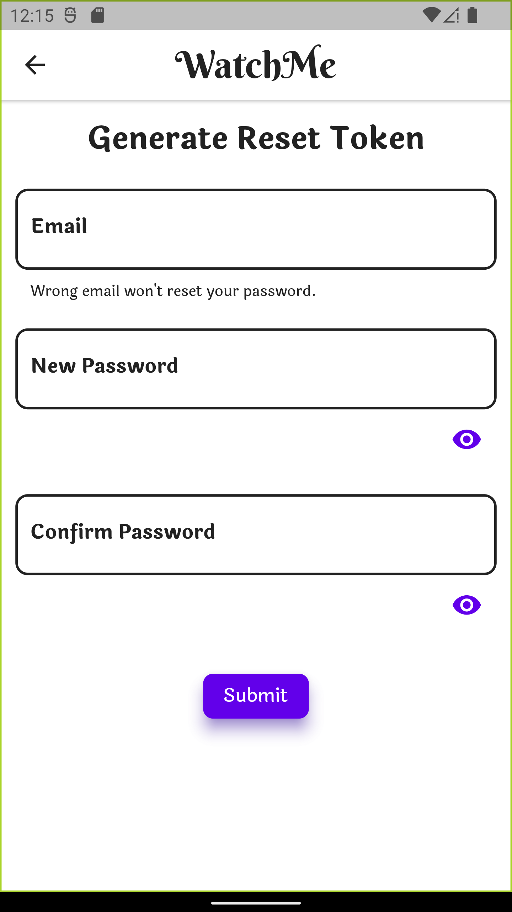
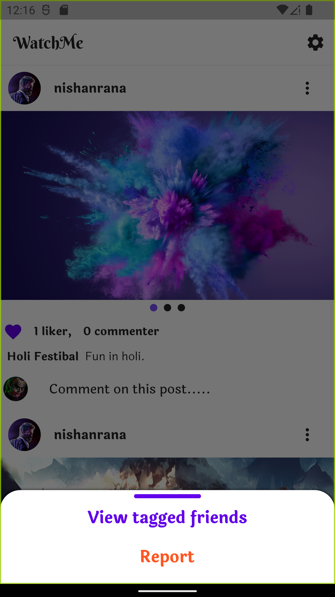
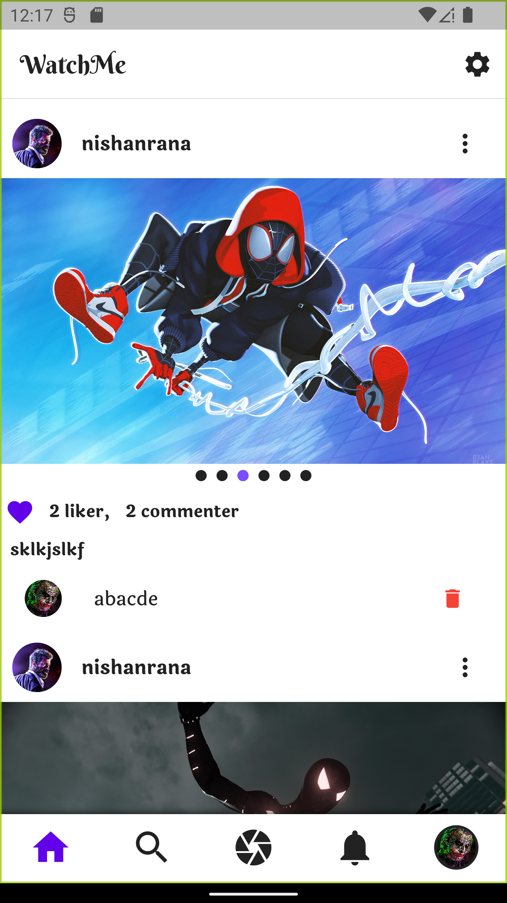
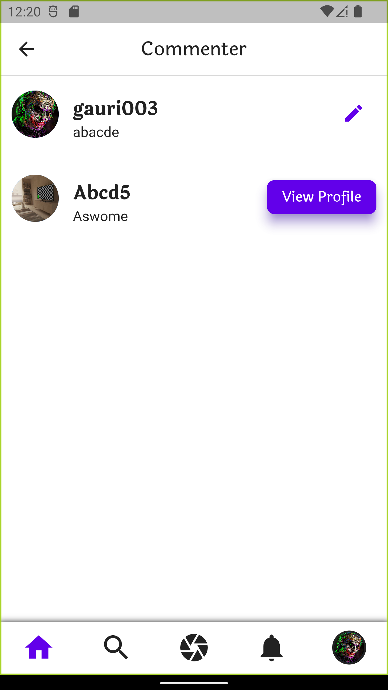

# Momento/WatchMe

A social media web/mobile app like instragram in react/flutter and Node.js is used for backend.

# Features

1. Upload post (1-12 images)
2. Wach and unwatch users
3. Tag watchers while uploading post
4. Get posts from watched users
5. Like post
6. Comment post
7. Report post
8. View the users who liked the post
9. View the users who commented on the post
10. View tagged users on the post
11. Search users according to username and email
12. Get Notifications of new posts, tagging, watching, like, comment, and report on the post
13. View user profile
14. View wathers
15. View watched users
16. view upload and tagged posts

# Web Screenshots

    
    
    
    
    
    
    
    
    
    
    
    
    
    
    
    
    
    
    

# Mobile Screenshots

    
    
    
    
    
    
    
    
    
    
    
    
    
    
    
    
    
    
    
    
    
    

