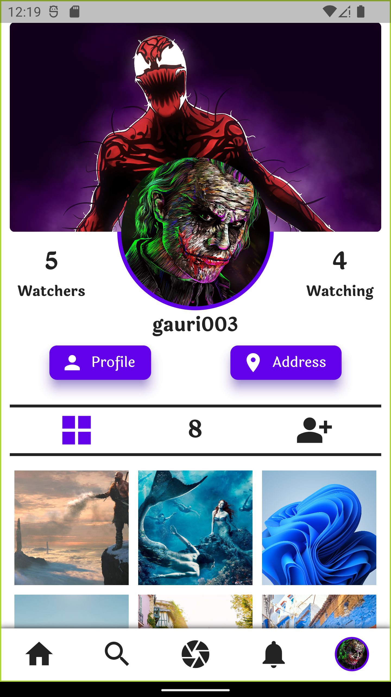

A social media web app like instragram in react.

# Note
The backend for this react project is made in Node.js and the bakcend is in the github reopository named "Memento-WatchMe-Backend".

# Features
1. Upload post (1-12 images) 
2. Wach and unwatch users 
3. Tag watchers while uploading post 
4. Get posts from watched users 
5. Like post 
6. Comment post 
7. Report post 
8. View the users who liked the post 
9. View the users who commented on the post 
10. View tagged users on the post 
11. Search users according to username and email 
12. Get Notifications of new posts, tagging, watching, like, comment, and report on the post 
13. View user profile 
14. View wathers 
15. View watched users 
16. view upload and tagged posts

# Screenshots

    
    
    
    
    
    
    
    
    
    
    
    
    
    
    
    
    
    
    

